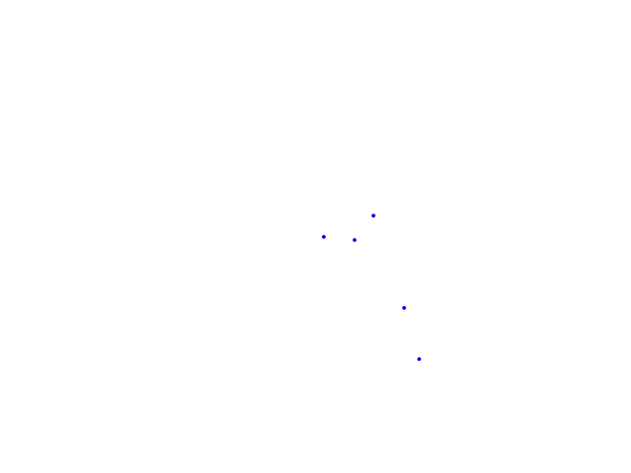

> ## Learning Objectives {.objectives}
>
> * Understand why it's important to test software

We're given some code that performs an *n-body simulation*
of objects under the influence of gravity; here is the code
that *advances* the system by *n* time steps:

#FIXME: Should code go here?

We're also given a script that uses the above code to simulate
the motion of the outer planets (Jupiter, Saturn, Uranus and Neptune)
around the Sun. Here is the output from our script:
#FIXME: make this GIF prettier
#FIXME: explain exactly what the GIF is showing

The output indicates that our code is broken,
but what's a good way to identify and fix the problem?
More importantly, once we've fixed it,
how can we guard against introducing new problems?
For instance, if we change the algorithm that computes
the positions and velocities of the bodies in the simulation,
how do we know our program is still going to produce the "right answer"?
And while we're on that subject, what *is* the right answer?

These are questions that we will answer in this lesson.
We'll write *tests* to check if our code is producing the right answer
(whatever that is).
With well-engineered tests,
we can be confident that our code will produce the right answer every time it is run.
When a test fails, we can more easily
identify the source of the error, and
tell which parts of our code need fixing.
